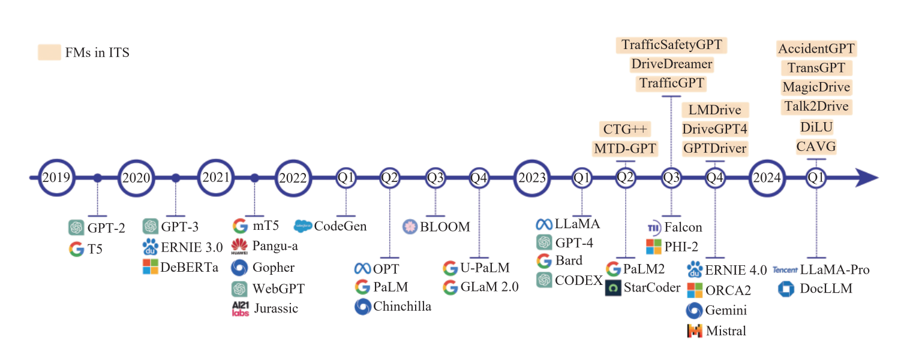
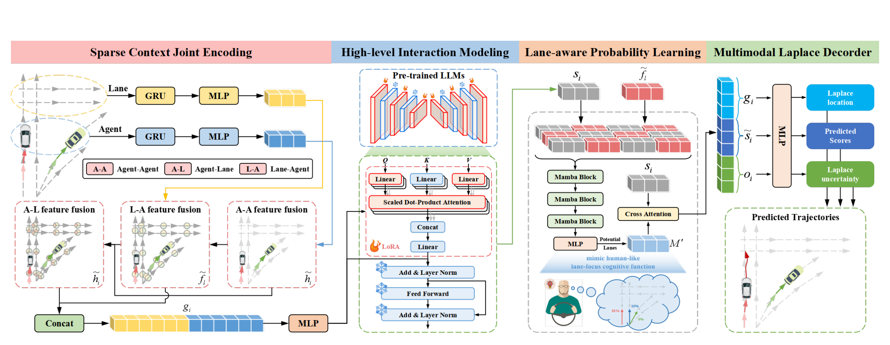
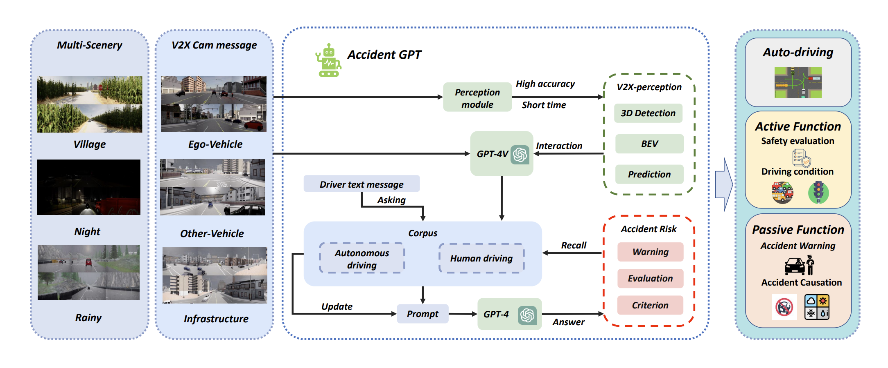
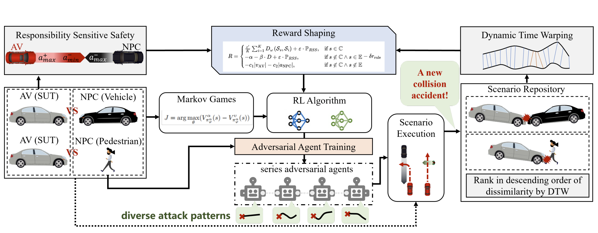
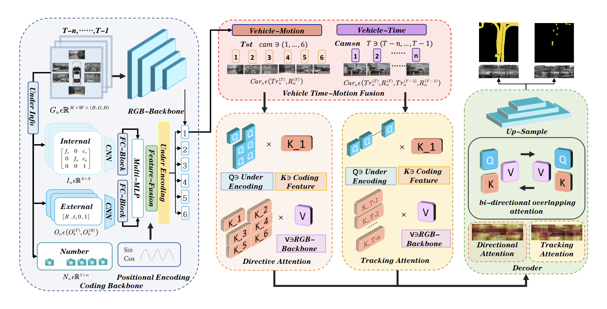
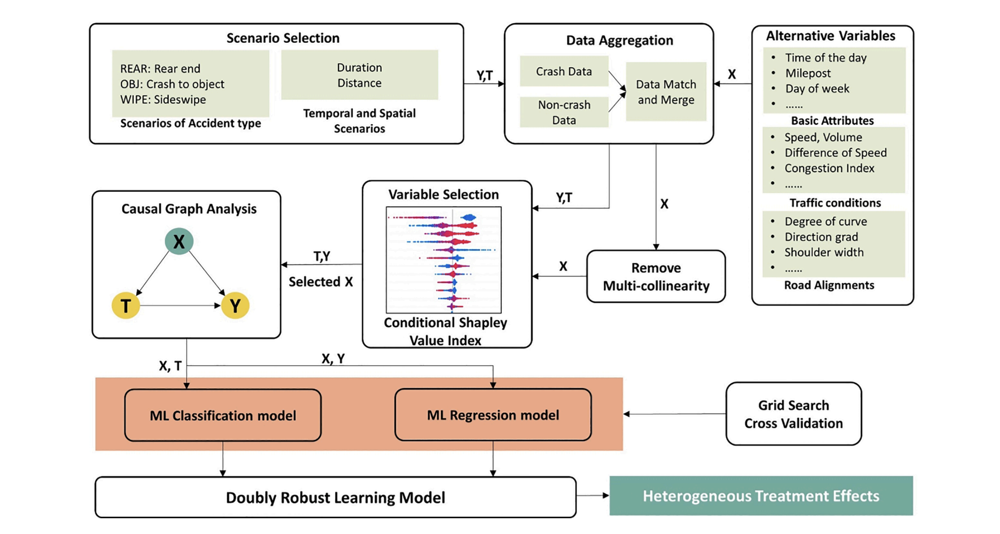
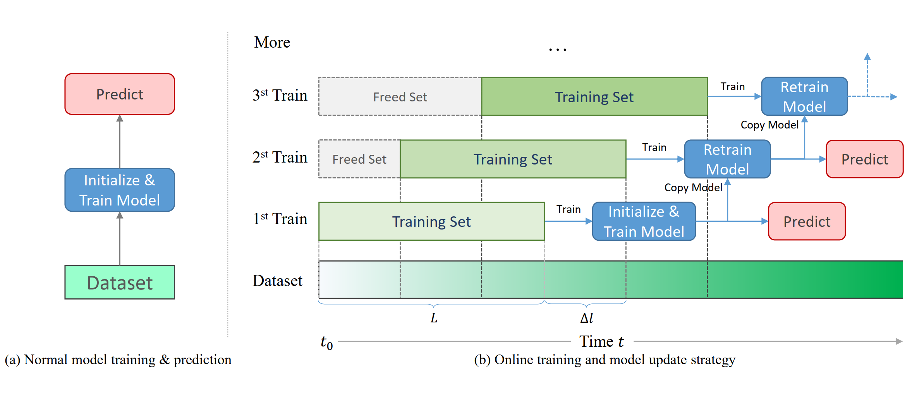
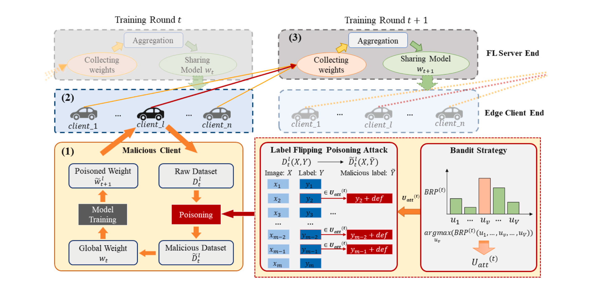
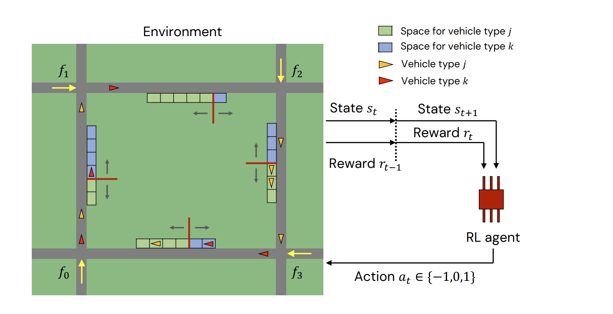
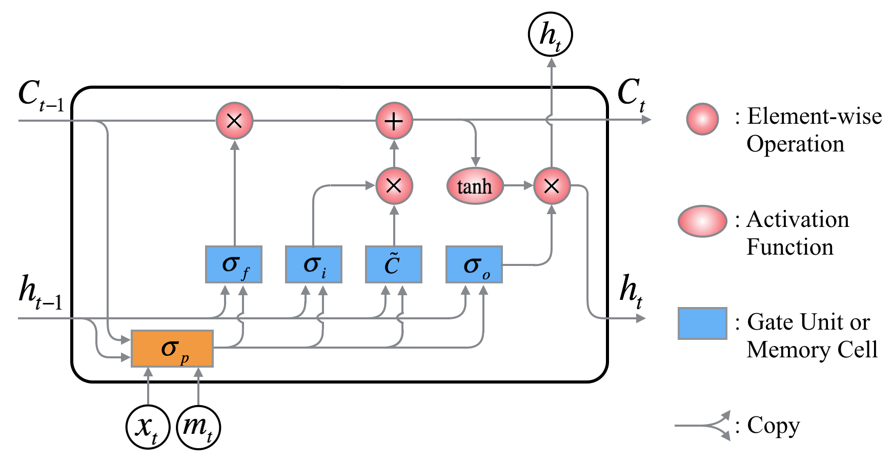

I am a **Professor** in the **State Key Lab of Intelligent Transportation Systems (ITS)** and the **School of Transportation Science and Engineering** at **Beihang University**. 

Before joining Beihang University, I was a UW Data Science Postdoctoral Fellow at the University of Washington. I received a Ph.D. degree in Civil Engineering (Transportation Engineering) from the University of Washington, a Master degree in Software Engineering from Peking University, and a Bachelor degree in Software Engineering from Beihang University. I was a visiting master student in the College of Electrical Engineering and Computer Science at National Taiwan University.

For urban systems to be smart and intelligent, they must be able to understand evolving patterns, reason about special phenomena, and optimize the operation in large-scale regions --  how should we leverage, devise, and interpret models that learn urban patterns from real-world data and adapt our current urban systems to the future? Towards this question and others, I work on building data-driven models using **machine learning** and **deep learning** technologies to reflect the real world. My work touches on a range of transportation problems including **LLM, autonomous driving, urban computing, traffic forecasting, human mobility modeling,** and **traffic control** . I'm open to new topics and collaborations, and feel free to reach out to me if you are interested.

<!-- ## Research Focus 
<table style="width:100%">
  <thead>
    <tr>
      <th width="100%">&nbsp;</th>
    </tr>
  </thead>
</table>

Artificial Intelligence, Large Models, Autonomous Driving, Urban Computing, Traffic Prediction and Control -->

## News 
<table style="width:100%">
  <thead>
    <tr>
      <th width="100%">&nbsp;</th>
    </tr>
  </thead>
</table>
*  New!  Jun. 2024. Our Paper [[AccidentGPT](https://arxiv.org/abs/2312.13156)\] received the Best Paper Award from the [IEEE T-IV & IV 24 Joint Workshop on Foundation Intelligence for Intelligent Vehicles](https://ieee-iv.org/2024/t-iv-iv-24-joint-workshop/).
*  New!  Dec. 2023. Our Paper [[ATT_FLAV](https://www.sciencedirect.com/science/article/pii/S0957417423007972)\] received the KIKUCHI-KARLAFTIS 2023 Best Paper Award from TRB AI Committee. 
<!-- *  New!  Mar. 2023. I start to work as a Professor in the [School of Transportation Science and Engineering](https://transportation.buaa.edu.cn/szdw/szdw/jtysgcx.htm) at Beihang University.  -->
*  New!  Dec. 2022. I'm honoured to receive the HKSTS Outstanding Dissertation Award cum Gordon Newell Memorial Prize. \[[link](http://www.hksts.org/awards_frame.htm)\]
<!-- *  New!  Mar. 2022. I start to work as an Associate Professor in the School of Transportation Science and Engineering at Beihang University.  -->
<!-- *  New!  Jan. 2022. I'm honoured to receive Honorable Mention in the  TRB AED50 Best Dissertation Competition. \[[link](https://sites.google.com/view/trbaed50/announcements/awards)\] -->
*  New!  Sept. 2021. I'm honoured to receive the IEEE ITSS Best Dissertation Award (First Prize).  \[[link](https://ieee-itss.org/awards/best-dissertation/)\]
<!-- *  New!  Apr. 2021. I'm honoured to receive the title of UW Data Science Postdoctoral Fellow from the eScience Institue, UW.  -->
<!-- *  New!  Mar. 2021. Gradudation! I defend my PhD final exam and graduate! -->
<!-- *  New!  Oct. 2020. Our paper receives the Best Paper Award presented by  IEEE International Smart Cities Conference 2020.  -->
<!-- *  New!  Oct. 2020. I give a talk at the Reasoning in GeoAI Mini-workshop. \[[link](http://spatial.ucsb.edu/mini-workshop/Reasoning_GeoAI/)\]  -->
<!-- *  New!  Sep. 2020. I give a talk at 2020 JSM’s Transportation Statistics Interest Group business meeting.  -->
<!-- *  New!  Jun. 2020. I'm honoured to receive the CEE Department Chair's Award from UW CEE department for recognizing the teaching contributions. \[[link](https://www.ce.washington.edu/news/article/2020-07-08/cee-department-award-winners-announced)\] -->
<!-- *  New!  May. 2020. Dr. Yinhai Wang and I give a presentation in [PacTrans Webinar](https://youtu.be/hw_fgkCQBmE): "Learning from Network-wide Traffic Sensor Data: Vehicle Travel and Traffic Performance Changes under the Influence of COVID-19". \[[YouTube](https://youtu.be/hw_fgkCQBmE)\]\[[Website](https://depts.washington.edu/pactrans/may-19-pactrans-webinar-featuring-yinhai-wang/)\] -->
<!-- *  New!  May. 2020. A [Traffic Performance Score Website](http://tps.uwstarlab.org/) for Measuring the traffic performance in the Greater Seattle area is developed by a team leading by me and released. \[[Website](http://tps.uwstarlab.org/)\]\[News: [UW CEE](https://www.ce.washington.edu/news/article/2020-05-13/measuring-traffic-performance-during-covid-19), [Urban@UW](https://depts.washington.edu/urbanuw/news/measuring-traffic-performance-during-covid-19/)\] -->
<!-- *  New!  May. 2020. Our paper "Graph Markov Network for Traffic Forecasting with Missing Data" is accepted by *Transportation Research Part C: Emerging Technologies* [[arXiv](https://arxiv.org/abs/1912.05457)\] \[[doi](https://doi.org/10.1016/j.trc.2020.102671)\] -->

<!-- *  New!  May. 2020. Our paper "Stacked Bidirectional and Unidirectional LSTM Recurrent Neural Network for Forecasting Network-wide Traffic State with Missing Values" is accepted by *Transportation Research Part C: Emerging Technologies* \[[doi](https://doi.org/10.1016/j.trc.2020.102674)\] -->

<!-- *  New!  Mar. 2020. Our paper "Learning Traffic as a Graph: A Gated Graph Wavelet Recurrent Neural Network for Network-scale Traffic Prediction" is accepted by *Transportation Research Part C: Emerging Technologies* \[[doi](https://doi.org/10.1016/j.trc.2020.102620)\] -->
<!-- *  New!  Mar. 2020. Our paper "Forecasting Transportation Network Speed Using Deep Capsule Networks with Nested LSTM Models " is accepted by *IEEE Transaction on Intelligent Transportation Systems* \[[doi](https://ieeexplore.ieee.org/document/9069477)\] -->
<!-- *  New!  Feb. 2020. Our paper "An Advanced Framework for Microscopic and Lane-level Macroscopic Traffic Parameters Estimation from UAV Video" is accepted by *IET Intelligent Transport Systems* \[[doi](https://doi.org/10.1049/iet-its.2019.0463)\] -->
<!-- *  New!  Feb. 2020. Our paper "Two-Stream Multi-Channel Convolutional Neural Network (TM-CNN) for Multi-Lane Traffic Speed Prediction Considering Traffic Volume Impact" is accepted by *Transportation Research Record* \[[doi](https://doi.org/10.1177/0361198120911052)\] -->
*  New!  Jan. 2020. Our paper \[[Graph Markov Network](https://arxiv.org/abs/1912.05457)\] received Student Paper Award from [ASA TSIG](https://community.amstat.org/tsig/home). 
<!-- *  New!  Oct. 2019. Two first-author and two co-authored papers are accepted for presentation at TRB 2020. -->
<!-- *  New!  Oct. 2019. I win the Second Prize in the 2019 PacTrans Annual Conference best poster contest. -->
<!-- *  New!  Oct. 2019. I give a talk at INFORMS 2019 entitled: "Learning Traffic as a Graph: Graph based Neural networks for Network-scale Traffic Prediction" \[[link](https://www.abstractsonline.com/notify/notifyintro.asp?MKey={DA9FD773-1961-4264-8491-297D9CB12146}&NKey={E86BA192-F3B7-46AB-AB2E-573BCB2C8F78})\] -->
<!-- *  New!  Sept. 2019. My first-author paper "Traffic Graph Convolutional Recurrent Neural Network: A Deep Learning Framework for Network-Scale Traffic Learning and Forecasting" is accepted by *IEEE Transaction on Intelligent Transportation Systems* \[[arXiv](https://arxiv.org/abs/1802.07007)\]\[[code](https://github.com/zhiyongc/Graph_Convolutional_LSTM)\] -->
<!-- *  New!  Sept. 2019. My first-author paper "Establishing a Multi-Source Data Integration Framework for Transportation Data Analytics" is accepted by *Journal of Transportation Engineering, Part A: Systems*  -->
<!-- *  New!  Aug. 2019. My first-author paper "Perspectives on Stability and Mobility of Transit Passenger’s Travel Behavior through Smart Card Data" is accepted by *IET Intelligent Transport Systems* \[[doi](https://doi.org/10.1049/iet-its.2019.0212)\] -->
<!-- *  New!  June 2019. Our invited review article "The Development of Smart Transportation in Urgent Need of Transportation Data Science (in Chinese)" is published at *Urban Transport of China* \[[doi](https://doi.org/10.13813/j.cn11-5141/u.2019.0301)\] --> 

<!-- *  New!  May 2019. I'm honoured to be a member of Transportation Research Board (TRB) Standing Committee on Intelligent Transportation Systems – AHB15  -->
<!-- *  New!  Apr. 2019. I'm honoured to be a member of Transportation Research Board (TRB) Standing Committee on Geospatial Data Acquisition Technologies - AFB80 -->
<!-- *  New!  Jan. 2019. Three papers are accepted by TRB Aunual Meeting 2019. I will give two oral presentations \[[1](https://trid.trb.org/view/1573071),[2](https://trid.trb.org/view/1646938)\] -->

<!-- ## Selected Research on Deep Learning based Traffic Prediction and Data Imputation -->
<!-- *	**Cui Z**, Lin L, Pu Z, Wang Y. (2020) Graph Markov Network for Traffic Forecasting with Missing Data. *Transportation Research Board 99th Annual Meeting* \[[arXiv](https://arxiv.org/abs/1912.05457)\] (**ASA TSIG Student Paper Award**) -->

<!-- *	**Cui Z**, Ke R, Pu Z, Ma X, Wang Y\*. (2020) Learning Traffic as a Graph: A Gated Graph Wavelet Recurrent Neural Network for Network-scale Traffic Prediction. *Transportation Research Part C: Emerging Technologies*  -->

<!-- * 	**Cui, Z.**, Henrickson, K., Ke, R., & Wang, Y.\* (2019). Traffic Graph Convolutional Recurrent Neural Network: A Deep Learning Framework for Network-Scale Traffic Learning and Forecasting. *IEEE Transaction on Intelligent Transportation Systems* \[[arXiv](https://arxiv.org/abs/1802.07007)\]\[[code](https://github.com/zhiyongc/Graph_Convolutional_LSTM)\]\[[data](https://github.com/zhiyongc/Seattle-Loop-Data)\] -->

<!--\[[slides](https://drive.google.com/file/d/1FxmyG88cAD3gO7pbEmor4uq3fINAK2yP/view?usp=sharing)\] -->

<!-- * 	**Cui, Z.**, Ke, R., & Wang, Y.\* (2018). Deep Bidirectional and Unidirectional LSTM Recurrent Neural Network for Network-wide Traffic Speed Prediction. (submitted to *IEEE Transaction on Intelligent Transportation Systems*; under review). \[[arXiv](https://arxiv.org/abs/1801.02143)\]\[[code](https://github.com/zhiyongc/Stacked_Bidirectional_Unidirectional_LSTM)\]\[[data](https://github.com/zhiyongc/Seattle-Loop-Data)\] -->
<!--\[[video](http://videolectures.net/zhiyong_cui/)\]-->

<!-- * 	Liang, Y., **Cui, Z.**, Tian, Y., Chen, H., & Wang, Y.\* (2018). A Deep Generative Adversarial Architecture for Network-Wide Spatial-Temporal Traffic State Estimation. *Transportation Research Record*. \[[arXiv](https://arxiv.org/abs/1801.03818)\] -->

## For Prospective Students
<table style="width:100%">
  <thead>
    <tr>
      <th width="100%">&nbsp;</th>
    </tr>
  </thead>
</table>
* I'm looking for Master and Ph.D. student applicants and undergrad interns. Please feel free to contact me if you are interested in working on "AI + Transportation" topics.

## Featured Research

<table style="width:100%">
    <thead>
		<tr>
			<th width="25%">Highlight</th>
			<th width="13%">Authors</th>
			<th width="40%">Title</th>
			<th width="2%">Year</th>
			<th width="20%">Journal/Proceedings</th>
		</tr>
    </thead>
	<tbody>
		<tr id="li2024steering" class="entry">
			<td>
				<!--  -->
				

				
				

				ITS with Foundation Models
				

				

			</td>
			<td>Z Li#, <strong>Z Cui</strong>#, H Liao, J Ash, G Zhang, C Xu, Y Wang* </td>
			<td>
				Steering the Future: Redefining Intelligent Transportation Systems with Foundation Models 
						
 
						[<a href="javascript:toggleInfo('li2024steering','abstract')">Abstract</a>]
						[<a href="javascript:toggleInfo('li2024steering','bibtex')">BibTeX</a>] 
						[<a href="https://ieeexplore.ieee.org/abstract/document/10595852">PDF</a>]
						<!-- [<a href="https://arxiv.org/pdf/2405.04909">arXiv</a>] -->
						<!-- [<a href="http://tps.uwstarlab.org/">Website</a>] -->
						<!-- [<a href="https://zhiyongcui.com/blog/2020/07/16/graph-markov-network.html">Post</a>] -->
						<!-- [<a href="https://github.com/zhiyongc/GraphMarkovNetwork">Code</a>] -->
						<!-- [<a href="https://github.com/zhiyongc/Graph_Convolutional_LSTM">code</a>] -->
					

			</td>
			<td>2024</td>
			<td>CHAIN</td>
		</tr>
		<tr id="abs_li2024steering" class="abstract noshow">
			<td colspan="5">
 <b>Abstract</b>: At the intersection of artificial intelligence and urban development, this paper unveils the pivotal role of Foundation Models (FMs) in revolutionizing Intelligent Transportation Systems (ITS). Against the backdrop of escalating urbanization and environmental concerns, we rigorously assess how FMs—spanning large language models, vision-language models, large multimodal models, etc.—can redefine urban mobility paradigms. Our discussion extends to the potential of modular, scalable models and strategic public-private partnerships in facilitating seamless integration. Through a comprehensive literature review and theoretical framework, this paper underscores the significant role of FMs in steering the future of transportation towards unprecedented levels of intelligence and responsiveness. The insights offered aim to guide policymakers, engineers, and researchers in the ethical and effective adoption of FMs, paving the way for a new era in transportation systems.
</td>
		</tr>
		<tr id="bib_li2024steering" class="bibtex noshow">
			<td colspan="5"><b>BibTeX</b>:
					<pre>@article{li2024steering,
  title={Steering the Future: Redefining Intelligent Transportation Systems with Foundation Models},
  author={Li, Zhenning and Cui, Zhiyong and Liao, Haicheng and Ash, John and Zhang, Guohui and Xu, Chengzhong and Wang, Yinhai},
  journal={CHAIN},
  volume={1},
  number={1},
  pages={46--53},
  year={2024},
  publisher={Youke Publishing}
}</pre>
			</td>
    	</tr>
		<!-- Item Finished -->
		<!-- Item Finished -->
		<!-- Item Finished -->
		<tr id="lan2024traj" class="entry">
			<td>
				<!--  -->
				

				
				

				Traj-LLM
				

				

			</td>
			<td>Z Lan, L Liu, B Fan, Y Lv, Y Ren*, <strong>Z Cui</strong>*</td>
			<td>
				Traj-LLM: A New Exploration for Empowering Trajectory Prediction With Pre-Trained Large Language Models 
						
 
						[<a href="javascript:toggleInfo('lan2024traj','abstract')">Abstract</a>]
						[<a href="javascript:toggleInfo('lan2024traj','bibtex')">BibTeX</a>] 
						[<a href="https://ieeexplore.ieee.org/abstract/document/10574364">PDF</a>]
						[<a href="https://arxiv.org/pdf/2405.04909">arXiv</a>]
						<!-- [<a href="http://tps.uwstarlab.org/">Website</a>] -->
						<!-- [<a href="https://zhiyongcui.com/blog/2020/07/16/graph-markov-network.html">Post</a>] -->
						<!-- [<a href="https://github.com/zhiyongc/GraphMarkovNetwork">Code</a>] -->
						<!-- [<a href="https://github.com/zhiyongc/Graph_Convolutional_LSTM">code</a>] -->
					

			</td>
			<td>2024</td>
			<td>IEEE Transactions on Intelligent Vehicles</td>
		</tr>
		<tr id="abs_lan2024traj" class="abstract noshow">
			<td colspan="5">
 <b>Abstract</b>: Predicting the future trajectories of dynamic traffic actors is a cornerstone task in autonomous driving. Though existing notable efforts have resulted in impressive performance improvements, a gap persists in scene cognitive and understanding of complex traffic semantics. This paper proposes Traj-LLM, the first to investigate the potential of using pre-trained Large Language Models (LLMs) without explicit prompt engineering to generate future motions from vehicular past trajectories and traffic scene semantics. Traj-LLM starts with sparse context joint encoding to dissect the agent and scene features into a form that LLMs understand. On this basis, we creatively explore LLMs' strong understanding capability to capture a spectrum of high-level scene knowledge and interactive information. To emulate the human-like lane focus cognitive function and enhance Traj-LLM's scene comprehension, we introduce lane-aware probabilistic learning powered by the Mamba module. Finally, a multi-modal Laplace decoder is designed to achieve scene-compliant predictions. Extensive experiments manifest that Traj-LLM, fueled by prior knowledge and understanding prowess of LLMs, together with lane-aware probability learning, transcends the state-of-the-art methods across most evaluation metrics. Moreover, the few-shot analysis serves to substantiate Traj-LLM's performance, as even with merely 50% of the dataset, it surpasses the majority of benchmarks relying on complete data utilization. This study explores endowing the trajectory prediction task with advanced capabilities inherent in LLMs, furnishing a more universal and adaptable solution for forecasting agent movements in a new way.
</td>
		</tr>
		<tr id="bib_lan2024traj" class="bibtex noshow">
			<td colspan="5"><b>BibTeX</b>:
					<pre>@article{lan2024traj,
title={Traj-llm: A new exploration for empowering trajectory prediction with pre-trained large language models},
author={Lan, Zhengxing and Liu, Lingshan and Fan, Bo and Lv, Yisheng and Ren, Yilong and Cui, Zhiyong},
journal={IEEE Transactions on Intelligent Vehicles},
year={2024},
publisher={IEEE}
}
					</pre>
			</td>
    	</tr>
		<!-- Item Finished -->
		<!-- Item Finished -->
		<!-- Item Finished -->
		<tr id="wang2023accidentgpt" class="entry">
			<td>
				<!--  -->
				

				
				

				AccidentGPT
				

				

			</td>
			<td>L Wang, H Jiang, P Cai, D Fu, T Wang, <strong>Z Cui</strong>*, Y Ren*, et al. </td>
			<td>
				AccidentGPT: Accident analysis and prevention from V2X environmental perception with multi-modal large model 
				(Best Paper Award) 
						
 
						[<a href="javascript:toggleInfo('wang2023accidentgpt','abstract')">Abstract</a>]
						[<a href="javascript:toggleInfo('wang2023accidentgpt','bibtex')">BibTeX</a>] 
						[<a href="https://accidentgpt.github.io/">Webpage</a>]
						[<a href="https://arxiv.org/abs/2312.13156">arXiv</a>]
						[<a href="https://github.com/LeningWang/AccidentGPT">GitHub</a>]
						<!-- [<a href="https://github.com/zhiyongc/GraphMarkovNetwork">Code</a>] -->
						<!-- [<a href="https://zhiyongcui.com/blog/2020/07/16/graph-markov-network.html">Post</a>] -->
						<!-- [<a href="https://github.com/zhiyongc/Graph_Convolutional_LSTM">code</a>] -->
					

			</td>
			<td>2024</td>
			<td>IEEE T-IV & IV 24 Joint Workshop on Foundation Intelligence for Intelligent Vehicles</td>
		</tr>
		<tr id="abs_wang2023accidentgpt" class="abstract noshow">
			<td colspan="5">
 <b>Abstract</b>: Traffic accidents, being a significant contributor to both human casualties and property damage, have long been a focal point of research for many scholars in the field of traffic safety. However, previous studies, whether focusing on static environmental assessments or dynamic driving analyses, as well as pre-accident predictions or post-accident rule analyses, have typically been conducted in isolation. There has been a lack of an effective framework for developing a comprehensive understanding and application of traffic safety. To address this gap, this paper introduces AccidentGPT, a comprehensive accident analysis and prevention multi-modal large model. AccidentGPT establishes a multi-modal information interaction framework grounded in multi-sensor perception, thereby enabling a holistic approach to accident analysis and prevention in the field of traffic safety. Specifically, our capabilities can be categorized as follows: for autonomous driving vehicles, we provide comprehensive environmental perception and understanding to control the vehicle and avoid collisions. For human-driven vehicles, we offer proactive long-range safety warnings and blind-spot alerts while also providing safety driving recommendations and behavioral norms through human-machine dialogue and interaction. Additionally, for traffic police and management agencies, our framework supports intelligent and real-time analysis of traffic safety, encompassing pedestrian, vehicles, roads, and the environment through collaborative perception from multiple vehicles and road testing devices. The system is also capable of providing a thorough analysis of accident causes and liability after vehicle collisions. Our framework stands as the first large model to integrate comprehensive scene understanding into traffic safety studies. Project page: https://accidentgpt.github.io/
</td>
		</tr>
		<tr id="bib_wang2023accidentgpt" class="bibtex noshow">
			<td colspan="5"><b>BibTeX</b>:
					<pre>@article{wang2023accidentgpt,
  title={AccidentGPT: Accident analysis and prevention from V2X environmental perception with multi-modal large model},
  author={Wang, Lening and Jiang, Han and Cai, Pinlong and Fu, Daocheng and Wang, Tianqi and Cui, Zhiyong and Ren, Yilong and Yu, Haiyang and Wang, Xuesong and Wang, Yinhai},
  journal={arXiv preprint arXiv:2312.13156},
  year={2023}
}</pre>
			</td>
    	</tr>
		<!-- Item Finished -->
		<!-- Item Finished -->
		<!-- Item Finished -->
		<tr id="cai2024adversarial" class="entry">
			<td>
				<!--  -->
				

				
				

				Adversarial Stress Test for AV
				

				

			</td>
			<td>X Cai, X Bai, <strong>Z Cui</strong>*, P Hang, H Yu, Y Ren* </td>
			<td>
				Adversarial Stress Test for Autonomous Vehicle Via Series Reinforcement Learning Tasks With Reward Shaping 
						
 
						[<a href="javascript:toggleInfo('cai2024adversarial','abstract')">Abstract</a>]
						[<a href="javascript:toggleInfo('cai2024adversarial','bibtex')">BibTeX</a>] 
						[<a href="https://ieeexplore.ieee.org/abstract/document/10571558">PDF</a>]
						<!-- [<a href="https://caixxuan.github.io/Text2Scenario.GitHub.io/">Webpage</a>] -->
						[<a href="https://github.com/caixxuan/AST-SRL">GitHub</a>]
						<!-- [<a href="https://github.com/zhiyongc/GraphMarkovNetwork">Code</a>] -->
						<!-- [<a href="https://zhiyongcui.com/blog/2020/07/16/graph-markov-network.html">Post</a>] -->
						<!-- [<a href="https://github.com/zhiyongc/Graph_Convolutional_LSTM">code</a>] -->
					

			</td>
			<td>2024</td>
			<td>IEEE Transactions on Intelligent Vehicles</td>
		</tr>
		<tr id="abs_cai2024adversarial" class="abstract noshow">
			<td colspan="5">
 <b>Abstract</b>: Testing is a pivotal phase for uncovering potential vulnerabilities in autonomous vehicles (AVs) to develop a secure autonomy system. However, existing methods often lack consideration for efficiently exploring multiple vulnerability-revealing cases, particularly under adversarial game scenarios. We introduce an evolving series reinforcement learning (RL) framework for adversarial policy training, integrating Responsibility Sensitive Safety (RSS) and Dynamic Time Warping (DTW) theories to shape the reward function to steer the evolving direction of the subsequent series agents for exploring vulnerability-revealing attack scenarios uncharted in the refined buffered repository. Our method undertakes adversarial stress tests for both black-box and white-box AV systems under test in driving tasks that engage in games with traffic vehicles and pedestrians. The results indicate that our approach expedites the exploration of additional scenarios blamed for the AV, outperforming the baselines in the vulnerability-revealing accident and scenario diversity. Furthermore, the causality of the collisions is qualitatively analyzed to provide insights for AV system vulnerability repair. Code is available at https://github.com/caixxuan/AST-SRL.
</td>
		</tr>
		<tr id="bib_cai2024adversarial" class="bibtex noshow">
			<td colspan="5"><b>BibTeX</b>:
					<pre>@article{cai2024adversarial,
  title={Adversarial Stress Test for Autonomous Vehicle Via Series Reinforcement Learning Tasks With Reward Shaping},
  author={Cai, Xuan and Bai, Xuesong and Cui, Zhiyong and Hang, Peng and Yu, Haiyang and Ren, Yilong},
  journal={IEEE Transactions on Intelligent Vehicles},
  year={2024},
  publisher={IEEE}
}
					</pre>
			</td>
    	</tr>
		<!-- Item Finished -->
		<!-- Item Finished -->
		<!-- Item Finished -->
		<tr id="ren2024uif" class="entry">
			<td>
				<!--  -->
				

				
				

				UIF-BEV
				

				

			</td>
			<td>Y Ren, L Wang, M Li, H Jiang, C Lin, H Yu*, <strong>Z Cui</strong>* </td>
			<td>UIF-BEV: An Underlying Information Fusion Framework for Bird's-Eye-View Semantic Segmentation 
						
 
						[<a href="javascript:toggleInfo('ren2024uif','abstract')">Abstract</a>]
						[<a href="javascript:toggleInfo('ren2024uif','bibtex')">BibTeX</a>] 
						[<a href="https://ieeexplore.ieee.org/abstract/document/10528892">PDF</a>]
						<!-- [<a href="https://caixxuan.github.io/Text2Scenario.GitHub.io/">Webpage</a>] -->
						[<a href="https://github.com/LeningWang/UIF-BEV">GitHub</a>]
						<!-- [<a href="https://github.com/zhiyongc/GraphMarkovNetwork">Code</a>] -->
						<!-- [<a href="https://zhiyongcui.com/blog/2020/07/16/graph-markov-network.html">Post</a>] -->
						<!-- [<a href="https://github.com/zhiyongc/Graph_Convolutional_LSTM">code</a>] -->
					

			</td>
			<td>2024</td>
			<td>IEEE Transactions on Intelligent Vehicles</td>
		</tr>
		<tr id="abs_ren2024uif" class="abstract noshow">
			<td colspan="5">
 <b>Abstract</b>: Semantic segmentation based on Bird's-eye-view (BEV) is crucial for autonomous driving. However, current methods for voxel-uplifting-based depth estimation often result in flattened ground, and transformer-based methods lack model interpretability, resulting in information loss and false transformations during image and multi-camera fusion. To tackle this issue, we propose UIF-BEV, an end-to-end framework that fuses underlying information for BEV semantic segmentation. In UIF-BEV, we construct a fusion encoder to combine the camera's underlying information and vehicle motion features across continuous frames, enabling multi-view conversion and image fusion. Additionally, we propose directional attention and tracking attention modules to enhance recognition accuracy and perception prediction for moving vehicles with varying speeds, taking into account their unsynchronized perspectives and timing. To generate segmentation results, we design a bi-directional overlapping attention decoding block that fuses multi-features. Experimental results using the nuScenes dataset demonstrate the effectiveness of UIF-BEV. It significantly improves the stitching effect of image edges and cross-views in semantic segmentation, while also reducing deformation errors caused by image transformations. Furthermore, UIF-BEV outperforms all benchmarks. Ablation experiments confirm the efficacy of each component in the framework. UIF-BEV presents a promising solution for real-time BEV map reconstruction and holds potential for various applications in the field of computer vision and autonomous driving. Our code can be publicly available at https://github.com/LeningWang/UIF-BEV.
</td>
		</tr>
		<tr id="bib_ren2024uif" class="bibtex noshow">
			<td colspan="5"><b>BibTeX</b>:
					<pre>@article{ren2024uif,
  title={UIF-BEV: An Underlying Information Fusion Framework for Bird's-Eye-View Semantic Segmentation},
  author={Ren, Yilong and Wang, Lening and Li, Minda and Jiang, Han and Lin, Chunmian and Yu, Haiyang and Cui, Zhiyong},
  journal={IEEE Transactions on Intelligent Vehicles},
  year={2024},
  publisher={IEEE}
}
					</pre>
			</td>
    	</tr>
		<!-- Item Finished -->
		<!-- Item Finished -->
		<!-- Item Finished -->
		<tr id="li2024inferring" class="entry">
			<td>
				<!--  -->
				

				
				

				DRL for treatment effects  
				

				

			</td>
			<td>S Li, Z Pu *, <strong>Z Cui</strong>*, S Lee, X Guo, D Ngoduy </td>
			<td>Inferring heterogeneous treatment effects of crashes on highway traffic: A doubly robust causal machine learning approach 
						
 
						[<a href="javascript:toggleInfo('li2024inferring','abstract')">Abstract</a>]
						[<a href="javascript:toggleInfo('li2024inferring','bibtex')">BibTeX</a>] 
						[<a href="https://www.sciencedirect.com/science/article/pii/S0968090X24000585">PDF</a>]
						[<a href="https://arxiv.org/pdf/2401.00781">arXiv</a>]
						<!-- [<a href="https://github.com/LeningWang/UIF-BEV">GitHub</a>] -->
						<!-- [<a href="https://github.com/zhiyongc/GraphMarkovNetwork">Code</a>] -->
						<!-- [<a href="https://zhiyongcui.com/blog/2020/07/16/graph-markov-network.html">Post</a>] -->
						<!-- [<a href="https://github.com/zhiyongc/Graph_Convolutional_LSTM">code</a>] -->
					

			</td>
			<td>2024</td>
			<td>Transportation research part C: emerging technologies</td>
		</tr>
		<tr id="abs_li2024inferring" class="abstract noshow">
			<td colspan="5">
 <b>Abstract</b>: Accurate estimating causal effects of crashes on highway traffic is crucial for mitigating the negative impacts of crashes. Previous studies have built up a series of methods via traditional causal inference theory and machine learning methods to estimate the impacts of crashes. Since the structures and variable dimensions of traditional causal inference models are pre-defined, they can not accommodate the characteristics of individual crashes. They only can estimate the average causal effects for the crashes in certain categories, e.g., crash types, crash severity, and occurring locations. For machine learning-based algorithms, they cannot be used for causal reasoning due to their reliance on correlation rather than causation. However, considering the impacts of crashes on traffic status vary across influential factors, such as time periods and locations, heterogeneous causal effects are essential for a better understanding of the effects on traffic status and crash intervention strategy development. To address the aforementioned issues, this study proposes a novel doubly robust causal machine learning framework to infer heterogeneous treatment effects of crashes on highway traffic status. Doubly Robust Learning (DRL), integrating machine learning techniques to perform predictive tasks, is applied into the framework due to its stronger robustness. Considerning treatment predictors and colliders may bring bias in estimation results, Conditional Shapley Value Index (CSVI) is proposed for selecting confounders from numerous factors. A 3-year crah dataset collected by 3594 real highway crashes in Washington is utilized for demonstrating the designed experiments, including construting confidence intervals, estimated errors evaluation, and sensitivity analysis of variable selection for various thresholds of CSVI. According to the results, the distinctive propagation and dissipation processes of congestion caused by various types of crashes can be achieved. The results also validate the effectiveness of variable selection, and the superiority in estimation accuracy compared to the selected baseline models. Future study includes considering spatial–temporal causal relationships and predicting counterfactual real-time traffic conditions.
</td>
		</tr>
		<tr id="bib_li2024inferring" class="bibtex noshow">
			<td colspan="5"><b>BibTeX</b>:
					<pre>@article{li2024inferring,
  title={Inferring heterogeneous treatment effects of crashes on highway traffic: A doubly robust causal machine learning approach},
  author={Li, Shuang and Pu, Ziyuan and Cui, Zhiyong and Lee, Seunghyeon and Guo, Xiucheng and Ngoduy, Dong},
  journal={Transportation research part C: emerging technologies},
  volume={160},
  pages={104537},
  year={2024},
  publisher={Elsevier}
}</pre>
			</td>
    	</tr>
		<!-- Item Finished -->
		<!-- Item Finished -->
		<!-- Item Finished -->
		<tr id="cui2024traffic" class="entry">
			<td>
				<!--  -->
				

				
				

				DRL for treatment effects  
				

				

			</td>
			<td><strong>Z Cui</strong>, MJ Tsai, M Zhu, H Yang, C Liu, S Yin, Y Wang </td>
			<td>Traffic Performance Score: Measuring Urban Mobility and Online Predicting of Near-Term Traffic, like Weather Forecasting 
						
 
						[<a href="javascript:toggleInfo('cui2024traffic','abstract')">Abstract</a>]
						[<a href="javascript:toggleInfo('cui2024traffic','bibtex')">BibTeX</a>] 
						[<a href="https://journals.sagepub.com/doi/abs/10.1177/03611981231222232">PDF</a>]
						[<a href="https://arxiv.org/pdf/2401.00781">arXiv</a>]
						<!-- [<a href="https://github.com/LeningWang/UIF-BEV">GitHub</a>] -->
						<!-- [<a href="https://github.com/zhiyongc/GraphMarkovNetwork">Code</a>] -->
						<!-- [<a href="https://zhiyongcui.com/blog/2020/07/16/graph-markov-network.html">Post</a>] -->
						<!-- [<a href="https://github.com/zhiyongc/Graph_Convolutional_LSTM">code</a>] -->
					

			</td>
			<td>2024</td>
			<td>Transportation Research Record</td>
		</tr>
		<tr id="abs_cui2024traffic" class="abstract noshow">
			<td colspan="5">
 <b>Abstract</b>: Measuring traffic performance is critical for public agencies which manage traffic and individuals who. This is the topic which the authors attempt to emphasize. One potential challenge for traffic prediction tasks is that short-term-incident-induced traffic pattern changes cannot be timely detected and the deployed model cannot adapt to the new traffic pattern. As for encountering long-term incidents, such as during COVID-19, traffic patterns are gradually changing, and the prediction model also needs to be periodically updated to avoid the so-called out-of-distribution problem. Therefore, the online training and predicting mechanisms can facilitate model updates, deployment of traffic prediction applications, and the planning of trips, especially when special events happen, such as the long-lasting COVID-19 pandemic. However, most existing traffic performance metrics narrowly focus on one aspect of the impacts but not comprehensive changes to the network. Further, during the pandemic, urban traffic patterns and travelers’ trip planning were dramatically affected and, thus, network-wide online traffic prediction became an urgent but more complicated task. To overcome such challenges, this study proposes a traffic performance score (TPS) incorporating multiple parameters for measuring both urban and freeway network-wide traffic performance. The TPS is compared with other metrics to show its superiority. To solve the challenging network-wide online traffic prediction task, this study also proposes an online training and updating strategy to predict network-wide traffic performance. Experimental results indicate that the proposed model with the online learning strategy outperforms existing methods in prediction accuracy and learning efficiency. In addition, the TPS measurement and its related online prediction functions are implemented on a publicly accessible platform and applied in real practice, which is another contribution of this work.
</td>
		</tr>
		<tr id="bib_cui2024traffic" class="bibtex noshow">
			<td colspan="5"><b>BibTeX</b>:
					<pre>@article{cui2024traffic,
  title={Traffic Performance Score: Measuring Urban Mobility and Online Predicting of Near-Term Traffic, like Weather Forecasting},
  author={Cui, Zhiyong and Tsai, Meng-Ju and Zhu, Meixin and Yang, Hao and Liu, Chenxi and Yin, Shuyi and Wang, Yinhai},
  journal={Transportation Research Record},
  pages={03611981231222232},
  publisher={SAGE Publications Sage CA: Los Angeles, CA}
}</pre>
			</td>
    	</tr>
		<!-- Item Finished -->
		<!-- Item Finished -->
		<!-- Item Finished -->
		<tr id="wang2023bandit" class="entry">
			<td>
				<!--  -->
				

				
				

				ATT_FLAV  
				

				

			</td>
			<td>S Wang, Q Li*, <strong>Z Cui</strong>*, J Hou, C Huang</td>
			<td>Bandit-based data poisoning attack against federated learning for autonomous driving models 
			(KIKUCHI-KARLAFTIS 2023 Best Paper Award) 
						
 
						[<a href="javascript:toggleInfo('wang2023bandit','abstract')">Abstract</a>]
						[<a href="javascript:toggleInfo('wang2023bandit','bibtex')">BibTeX</a>] 
						[<a href="https://www.sciencedirect.com/science/article/pii/S0957417423007972">PDF</a>]
						<!-- [<a href="https://arxiv.org/pdf/2401.00781">arXiv</a>] -->
						<!-- [<a href="https://github.com/LeningWang/UIF-BEV">GitHub</a>] -->
						<!-- [<a href="https://github.com/zhiyongc/GraphMarkovNetwork">Code</a>] -->
						<!-- [<a href="https://zhiyongcui.com/blog/2020/07/16/graph-markov-network.html">Post</a>] -->
						<!-- [<a href="https://github.com/zhiyongc/Graph_Convolutional_LSTM">code</a>] -->
					

			</td>
			<td>2023</td>
			<td>Expert Systems with Applications</td>
		</tr>
		<tr id="abs_wang2023bandit" class="abstract noshow">
			<td colspan="5">
 <b>Abstract</b>: In Internet of Things (IoT) applications, federated learning is commonly used for distributedly training models in a privacy-preserving manner. Recently, federated learning is broadly applied to autonomous driving for training intelligent decision models without disseminating local data remotely. Although federated learning provides a safer training manner for protecting data privacy in autonomous driving, the model training process is still vulnerable to poisoning attacks from vehicle client ends. It is beneficial to study poisoning attacks for enhancing the robustness of the training process to generate reliable decisions for safe driving. Until now, a few researches on poisoning attacks against classification models under federated learning scenarios have been proposed. However, those poisoning attacks against classification tasks cannot be directly applied to regression tasks in a federated learning framework, especially autonomous driving tasks such as steering angle control and brake control. The biggest challenge is that the output of non-linear regression models in federated learning is a dynamic sequential value decided by an online updated non-linear function. Thus, minor attacks can affect the overall non-linear function inference outputs leading to a failed stealthy attack. Based on existing challenges, this paper proposes an ATTack against Federated Learning based Autonomous Vehicle framework(ATT_FLAV) to evaluate and enhance the robustness of the federated learning-based autonomous driving models and take the steering angle control task as a representative non-linear regression task to illustrate the methodology. In the proposed framework, a bandit-based AttackRegion-UCB (AR-UCB) algorithm is designed for dynamic data poisoning attacks against the non-linear regression model. This is a black-box attack strategy that chooses the target attack label region dynamically in each federated learning round based on historical attack experiences. Compared with the attack performance of baseline poisoning attacks and the robustness under defense schemas, the proposed poisoning attack strategy can achieve superior attack performance via continuous data poisoning attacks against the federated learning framework.
</td>
		</tr>
		<tr id="bib_wang2023bandit" class="bibtex noshow">
			<td colspan="5"><b>BibTeX</b>:
					<pre>@article{wang2023bandit,
  title={Bandit-based data poisoning attack against federated learning for autonomous driving models},
  author={Wang, Shuo and Li, Qianmu and Cui, Zhiyong and Hou, Jun and Huang, Chanying},
  journal={Expert Systems with Applications},
  volume={227},
  pages={120295},
  year={2023},
  publisher={Elsevier}
}</pre>
			</td>
    	</tr>
		<!-- Item Finished -->
		<!-- Item Finished -->
		<!-- Item Finished -->
		<tr id="yin2022reinforcement" class="entry">
			<td>
				<!--  -->
				

				
				

				RL for Curbside Space Management 
				

				

			</td>
			<td>S Yin, <strong>Z Cui</strong>, Y Wang</td>
			<td>Reinforcement Learning for Curbside Space Management with Infrastructure Autonomy and Mixed Vehicle Connectivity 
						
 
						[<a href="javascript:toggleInfo('yin2022reinforcement','abstract')">Abstract</a>]
						[<a href="javascript:toggleInfo('yin2022reinforcement','bibtex')">BibTeX</a>] 
						[<a href="https://ieeexplore.ieee.org/abstract/document/9922149">PDF</a>]
						<!-- [<a href="https://arxiv.org/pdf/2401.00781">arXiv</a>] -->
						<!-- [<a href="https://github.com/LeningWang/UIF-BEV">GitHub</a>] -->
						<!-- [<a href="https://github.com/zhiyongc/GraphMarkovNetwork">Code</a>] -->
						<!-- [<a href="https://zhiyongcui.com/blog/2020/07/16/graph-markov-network.html">Post</a>] -->
						<!-- [<a href="https://github.com/zhiyongc/Graph_Convolutional_LSTM">code</a>] -->
					

			</td>
			<td>2022</td>
			<td>IEEE International Conference on Intelligent Transportation Systems</td>
		</tr>
		<tr id="abs_yin2022reinforcement" class="abstract noshow">
			<td colspan="5">
 <b>Abstract</b>: Urban curbside parking has been a headache for a wide range of urban stakeholders. It is difficult to solve and is rarely regarded independent from the well-studied parking management problem. However, a closer look at its properties and a comparison points out the unique features of curbside parking game that involves both the parking/cruising traffic and the roadway traffic. Two gaps in literature and prototypes that shape the future of the curbside are identified. And to bridge them, this paper proposes to innovatively solve it by infrastructure autonomy, modeling the curbs as agents. Later, this study considers heterogeneity of vehicles in two dimensions and connects them to reduce problem complexity. A model for curbside space management (CSM) is developed and solved via a reinforcement learning (RL) scheme. Partial observations and full information are fed to different components in the model respectively for robust training. Results based on simulation show the proposed model outperform two baseline control strategies and learns robustly.
</td>
		</tr>
		<tr id="bib_yin2022reinforcement" class="bibtex noshow">
			<td colspan="5"><b>BibTeX</b>:
					<pre>@inproceedings{yin2022reinforcement,
  title={Reinforcement Learning for Curbside Space Management with Infrastructure Autonomy and Mixed Vehicle Connectivity},
  author={Yin, Shuyi and Cui, Zhiyong and Wang, Yinhai},
  booktitle={2022 IEEE 25th International Conference on Intelligent Transportation Systems (ITSC)},
  pages={3276--3282},
  year={2022},
  organization={IEEE}
}</pre>
			</td>
    	</tr>
		<!-- Item Finished -->
		<!-- Item Finished -->
		<!-- Item Finished -->
		<tr id="cui2020traffic" class="entry">
			<td>
				<!--  -->
				

				
				

				Traffic Performance Score
				

				

			</td>
			<td><strong>Z. Cui</strong>, et al.*</td>
			<td>
				Traffic Performance Score for Measuring the Impact of COVID-19 on Urban Mobility 
						
 
						[<a href="javascript:toggleInfo('cui2020traffic','abstract')">Abstract</a>]
						[<a href="javascript:toggleInfo('cui2020traffic','bibtex')">BibTeX</a>] 
						<!-- [<a href="https://ieeexplore.ieee.org/abstract/document/8956222">PDF</a>] -->
						[<a href="http://tps.uwstarlab.org/">Website</a>]
						[<a href="https://arxiv.org/pdf/2007.00648">arXiv</a>]
						<!-- [<a href="https://zhiyongcui.com/blog/2020/07/16/graph-markov-network.html">Post</a>] -->
						<!-- [<a href="https://github.com/zhiyongc/GraphMarkovNetwork">Code</a>] -->
						<!-- [<a href="https://github.com/zhiyongc/Graph_Convolutional_LSTM">code</a>] -->
					

			</td>
			<td>2021</td>
			<td>TRB Annual Meeting 2021</td>
		</tr>
		<tr id="abs_cui2020traffic" class="abstract noshow">
			<td colspan="5">
 <b>Abstract</b>: Measuring traffic performance is critical for public agencies who manage traffic and individuals who plan trips, especially when special events happen. The COVID-19 pandemic has significantly influenced almost every aspect of daily life, including urban traffic patterns. Thus, it is important to measure the impact of COVID-19 on transportation to further guide agencies and residents to properly respond to changes in traffic patterns. However, most existing traffic performance metrics incorporate only a single traffic parameter and measure only the performance of individual corridors. To overcome these challenges, in this study, a Traffic Performance Score (TPS) is proposed that incorporates multiple parameters for measuring network-wide traffic performance. An interactive web-based TPS platform that provides real-time and historical spatial-temporal traffic performance analysis is developed by the STAR Lab at the University of Washington. Based on data from this platform, this study analyzes the impact of COVID-19 on different road segments and the traffic network as a whole. Considering this pandemic has greatly reshaped social and economic operations, this study also evaluates how COVID-19 is changing the urban mobility from both travel demand and driving behavior perspectives.
</td>
		</tr>
		<tr id="bib_cui2020traffic" class="bibtex noshow">
			<td colspan="5"><b>BibTeX</b>:
				<pre>@article{cui2020traffic,
title={Traffic Performance Score for Measuring the Impact of COVID-19 on Urban Mobility},
author={Cui, Zhiyong and Zhu, Meixin and Wang, Shuo and Wang, Pengfei and Zhou, Yang and Cao, Qianxia and Kopca, Cole and Wang, Yinhai},
journal={arXiv preprint arXiv:2007.00648},
year={2020}
}
				</pre>
			</td>
    	</tr>
		<!-- Item Finished -->
		<!-- Item Finished -->
		<!-- Item Finished -->
		<tr id="cui2019graph" class="entry">
      		<td>
				<!--  -->
				

				  
				  

				  Graph Markov Network
				  

				

			</td>
       		<td><strong>Z. Cui</strong>, L. Lin, Z. Pu, Y. Wang*</td>
			<td>
				Graph Markov Network for Traffic Forecasting with Missing Data 
				(ASA TSIG Student Paper Award) 
              	
 
              		[<a href="javascript:toggleInfo('cui2020graph','abstract')">Abstract</a>]
              		[<a href="javascript:toggleInfo('cui2020graph','bibtex')">BibTeX</a>] 
              		[<a href="https://www.sciencedirect.com/science/article/pii/S0968090X20305866">PDF</a>]
              		[<a href="https://arxiv.org/abs/1912.05457">arXiv</a>]
                  	[<a href="https://zhiyongcui.com/blog/2020/07/16/graph-markov-network.html">Post</a>]
                  	[<a href="https://github.com/zhiyongc/GraphMarkovNetwork">GitHub</a>]
            	

    		</td>
 			<td>2020</td>
        	<td>Transportation Research Part C: Emerging Technologies</td>
        </tr>
        <tr id="abs_cui2020graph" class="abstract noshow">
        	<td colspan="5">
 <b>Abstract</b>: Traffic forecasting is a classical task for traffic management and it plays an important role in intelligent transportation systems. However, since traffic data are mostly collected by traffic sensors or probe vehicles, sensor failures and the lack of probe vehicles will inevitably result in missing values in the collected raw data for some specific links in the traffic network. Although missing values can be imputed, existing data imputation methods normally need long-term historical traffic state data. As for short-term traffic forecasting, especially under edge computing and online prediction scenarios, traffic forecasting models with the capability of handling missing values are needed. In this study, we consider the traffic network as a graph and define the transition between network-wide traffic states at consecutive time steps as a graph Markov process. In this way, missing traffic states can be inferred step by step and the spatial-temporal relationships among the roadway links can be Incorporated. Based on the graph Markov process, we propose a new neural network architecture for spatial-temporal data forecasting, i.e. the graph Markov network (GMN). By incorporating the spectral graph convolution operation, we also propose a spectral graph Markov network (SGMN). The proposed models are compared with baseline models and tested on three real-world traffic state datasets with various missing rates. Experimental results show that the proposed GMN and SGMN can achieve superior prediction performance in terms of both accuracy and efficiency. Besides, the proposed models' parameters, weights, and predicted results are comprehensively analyzed and visualized.
</td>
      	</tr>
        <tr id="bib_cui2020graph" class="bibtex noshow">
          <td colspan="5"><b>BibTeX</b>:
                <pre>@article{cui2020graph,
  title={Graph markov network for traffic forecasting with missing data},
  author={Cui, Zhiyong and Lin, Longfei and Pu, Ziyuan and Wang, Yinhai},
  journal={Transportation Research Part C: Emerging Technologies},
  volume={117},
  pages={102671},
  year={2020},
  publisher={Elsevier}
}</pre>
      </td>
    </tr>
    <tr id="cui2020stacked" class="entry">
          <td>
        <!--  -->
        

          
          

          LSTM-Imputation
          

        

      </td>
          <td><strong>Z. Cui</strong>, R. Ke, Z. Pu, Y. Wang*</td>
      <td>
        Stacked Bidirectional and Unidirectional LSTM Recurrent Neural Network for Forecasting Network-wide Traffic State with Missing Values 
                
 
                  [<a href="javascript:toggleInfo('cui2020stacked','abstract')">Abstract</a>]
                  [<a href="javascript:toggleInfo('cui2020stacked','bibtex')">BibTeX</a>] 
                  [<a href="https://www.sciencedirect.com/science/article/pii/S0968090X20305891">PDF</a>]
                  <!-- [<a href="https://arxiv.org/abs/1912.05457">arXiv</a>] -->
                  <!-- [<a href="https://github.com/zhiyongc/Graph_Convolutional_LSTM">code</a>] -->
              

        </td>
      <td>2020</td>
          <td>Transportation Research Part C: Emerging Technologies</td>
        </tr>
        <tr id="abs_cui2020stacked" class="abstract noshow">
          <td colspan="5">
 <b>Abstract</b>: Short-term traffic forecasting based on deep learning methods, especially recurrent neural networks (RNN), has received much attention in recent years. However, the potential of RNN-based models in traffic forecasting has not yet been fully exploited in terms of the predictive power of spatial-temporal data and the capability of handling missing data. In this paper, we focus on RNN-based models and attempt to reformulate the way to incorporate RNN and its variants into traffic prediction models. A stacked bidirectional and unidirectional LSTM network architecture (SBU-LSTM) is proposed to assist the design of neural network structures for traffic state forecasting. As a key component of the architecture, the bidirectional LSTM (BDLSM) is exploited to capture the forward and backward temporal dependencies in spatiotemporal data. To deal with missing values in spatial-temporal data, we also propose a data imputation mechanism in the LSTM structure (LSTM-I) by designing an imputation unit to infer missing values and assist traffic prediction. The bidirectional version of LSTM-I is incorporated in the SBU-LSTM architecture. Two real-world network-wide traffic state datasets are used to conduct experiments and published to facilitate further traffic prediction research. The prediction performance of multiple types of multi-layer LSTM or BDLSTM models is evaluated. Experimental results indicate that the proposed SBU-LSTM architecture, especially the two-layer BDLSTM network, can achieve superior performance for the network-wide traffic prediction in both accuracy and robustness. Further, comprehensive comparison results show that the proposed data imputation mechanism in the RNN-based models can achieve outstanding prediction performance when the model's input data contains different patterns of missing values.
</td>
        </tr>
        <tr id="bib_cui2020stacked" class="bibtex noshow">
          <td colspan="5"><b>BibTeX</b>:
                <pre>@article{cui2020stacked,
  title={Stacked Bidirectional and Unidirectional LSTM Recurrent Neural Network for Forecasting Network-wide Traffic State with Missing Values},
  author={Cui, Zhiyong and Ke, Ruimin and Pu, Ziyuan and Wang, Yinhai},
  journal={arXiv preprint arXiv:2005.11627},
  year={2020}
}</pre>
      </td>
    </tr>
    <tr id="cui2020learning" class="entry">
          <td>
        <!--  -->
        

          
          

          Gated Graph Wavelet RNN
          

        

      </td>
          <td><strong>Z. Cui</strong>, R. Ke, Z. Pu, X. Ma, Y. Wang *</td>
      <td>
        Learning Traffic as a Graph: A Gated Graph Wavelet Recurrent Neural Network for Network-scale Traffic Prediction 
        <!-- 
          (Winner of Best Student Paper)
         -->
                
 
                  [<a href="javascript:toggleInfo('cui2020learning','abstract')">Abstract</a>]
                  [<a href="javascript:toggleInfo('cui2020learning','bibtex')">BibTeX</a>] 
                  [<a href="https://www.sciencedirect.com/science/article/pii/S0968090X19306448">PDF</a>]
                  <!-- [<a href="https://arxiv.org/abs/1802.07007">arXiv</a>] -->
                  <!-- [<a href="https://github.com/zhiyongc/Graph_Convolutional_LSTM">code</a> -->
              

        </td>
      <td>2020</td>
          <td>Transportation Research Part C: Emerging Technologies</td>
        </tr>
        <tr id="abs_cui2020learning" class="abstract noshow">
          <td colspan="5">
 <b>Abstract</b>: TNetwork-wide traffic forecasting is a critical component of modern intelligent transportation systems for urban traffic management and control. With the rise of artificial intelligence, many recent studies attempted to use deep neural networks to extract comprehensive features from traffic networks to enhance prediction performance, given the volume and variety of traffic data has been greatly increased. Considering that traffic status on a road segment is highly influenced by the upstream/downstream segments and nearby bottlenecks in the traffic network, extracting well-localized features from these neighboring segments is essential for a traffic prediction model. Although the convolution neural network or graph convolution neural network has been adopted to learn localized features from the complex geometric or topological structure of traffic networks, the lack of flexibility in the local-feature extraction process is still a big issue. Classical wavelet transform can detect sudden changes and peaks in temporal signals. Analogously, when extending to the graph/spectral domain, graph wavelet can concentrate more on key vertices in the graph and discriminatively extract localized features. In this study, to capture the complex spatial-temporal dependencies in network-wide traffic data, we learn the traffic network as a graph and propose a graph wavelet gated recurrent (GWGR) neural network. The graph wavelet is incorporated as a key component for extracting spatial features in the proposed model. A gated recurrent structure is employed to learn temporal dependencies in the sequence data. Comparing to baseline models, the proposed model can achieve state-of-the-art prediction performance and training efficiency on two real-world datasets. In addition, experiments show that the sparsity of graph wavelet weight matrices greatly increases the interpretability of GWGR.
</td>
        </tr>
        <tr id="bib_cui2020learning" class="bibtex noshow">
          <td colspan="5"><b>BibTeX</b>:
                <pre>@article{cui2020learning,
title={Learning traffic as a graph: A gated graph wavelet recurrent neural network for network-scale traffic prediction},
author={Cui, Zhiyong and Ke, Ruimin and Pu, Ziyuan and Ma, Xiaolei and Wang, Yinhai},
journal={Transportation Research Part C: Emerging Technologies},
volume={115},
pages={102620},
year={2020},
publisher={Elsevier}
}</pre>
      </td>
    </tr>
  	<tr id="bib_cui2019graph" class="bibtex noshow">
        	<td colspan="5"><b>BibTeX</b>:
              	<pre>@article{cui2019graph,
  title={Graph Markov Network for Traffic Forecasting with Missing Data},
  author={Cui, Zhiyong and Lin, Longfei and Pu, Ziyuan and Wang, Yinhai},
  journal={arXiv preprint arXiv:1912.05457},
  year={2019}
}</pre>
			</td>
      	</tr>
      	<tr id="ainet" class="entry">
      		<td>
				<!--  -->
				

				  
				  

				  Transportation AI Platform
				  

				

			</td>
       		<td><strong>Z. Cui</strong>, M. Fu, M. Zhu, X. Ban, Y. Wang* </td>
			<td>
				An Artificial Intelligence Platform for Network-Wide Congestion Detection and Prediction using Multi-Source Data 
              	
 
              		[<a href="javascript:toggleInfo('ainet','abstract')">Abstract</a>]
              		<!-- [<a href="javascript:toggleInfo('cui2019graph','bibtex')">BibTeX</a>]  -->
              		<!-- [<a href="https://ieeexplore.ieee.org/abstract/document/8956222">PDF</a>] -->
              		<!-- [<a href="https://arxiv.org/abs/1912.05457">arXiv</a>] -->
              		<!-- [<a href="https://github.com/zhiyongc/Graph_Convolutional_LSTM">code</a>] -->
              		[<a href="https://zhiyongcui.com/TRAFFIX_Web/">Website</a>]
              		[<a href="http://c2smart.engineering.nyu.edu/2019/04/19/an-artificial-intelligence-platform-for-network-wide-congestion-detection-and-prediction-using-multi-source-data-2/">Project</a>]
              		[<a href="http://c2smart.engineering.nyu.edu/wp-content/uploads/2019/07/Transportation_AI%20Platform_FinalReport_C2SMART_Wang.pdf">Report</a>]
            	

    		</td>
 			<td>2020</td>
        	<td>Under Review  (Presented at TRB 2020) </td>
        </tr>
        <tr id="abs_ainet" class="abstract noshow">
        	<td colspan="5">
 <b>Abstract</b>: The advancement of new smart traffic sensing, mobile communication, and artificial intelligence technologies has greatly stimulated the growth of transportation data. The increase of computation power enabled by advanced hardware and the rise of artificial intelligence (AI) technologies provides great opportunities to comprehensively utilize the transportation big data. Transportation domain knowledge is beneficial for designing AI models and solving transportation problems. However, because most AI algorithms were not originally designed for transportation problems, using big data and AI technologies to solve transportation problems is facing challenges. Since key hyper-parameters are missed in some proposed AI models, many proposed AI-based methods can hardly be accurately re-implemented. Further, in most of the AI-based transportation research studies, there is no uniform dataset to evaluate the proposed models. In this study, to overcome the challenges mentioned earlier, we propose a transportation AI platform with widely accepted datasets, provide well-established models, and use uniform training and testing procedures to assist the evaluation of emerging novel methodologies. We design a novel architecture for platform to enhance the efficiency of the transportation data processing, management, and communication and increase the computational power of the platform. Traffic forecasting involving high-dimensional spatiotemporal data is a good applicable scenario to utilize novel deep learning models to solve complicated transportation problems. The developed transportation AI platform is capable of evaluating the traffic prediction performance of various implemented models by comparing and visualizing the prediction results tested on multiple real-world network-wide traffic state data sets.
</td>
      	</tr>
      	<!-- <tr id="bib_ainet" class="bibtex noshow">
        	<td colspan="5"><b>BibTeX</b>:
              	<pre>@article{cui2019graph,
  title={Graph Markov Network for Traffic Forecasting with Missing Data},
  author={Cui, Zhiyong and Lin, Longfei and Pu, Ziyuan and Wang, Yinhai},
  journal={arXiv preprint arXiv:1912.05457},
  year={2019}
}</pre>
			</td>
      	</tr> -->
		<tr id="ma2020forecasting" class="entry">
      		<td>
				<!--  -->
				

				  
				  

				  CapsNet Nested LSTM
				  

				

			</td>
       		<td>X. Ma, H. Zhong, Y. Li, J. Ma, <strong>Z. Cui*</strong>, Y. Wang</td>
			<td>
				Forecasting Transportation Network Speed Using Deep Capsule Networks with Nested LSTM Models 
				<!-- 
					(Winner of Best Student Paper)
				 -->
              	
 
              		[<a href="javascript:toggleInfo('ma2020forecasting','abstract')">Abstract</a>]
              		[<a href="javascript:toggleInfo('ma2020forecasting','bibtex')">BibTeX</a>] 
              		[<a href="https://ieeexplore.ieee.org/abstract/document/9069477">PDF</a>]
              		[<a href="https://arxiv.org/abs/1811.04745">arXiv</a>]
              		<!-- [<a href="https://github.com/zhiyongc/Graph_Convolutional_LSTM">code</a> -->
            	

    		</td>
 			<td>2020</td>
        	<td>IEEE Transportation on Intelligent Transportation Systems</td>
        </tr>
        <tr id="abs_ma2020forecasting" class="abstract noshow">
        	<td colspan="5">
 <b>Abstract</b>: Accurate and reliable traffic forecasting for complicated transportation networks is of vital importance to modern transportation management. The complicated spatial dependencies of roadway links and the dynamic temporal patterns of traffic states make it particularly challenging. To address these challenges, we propose a new capsule network (CapsNet) to extract the spatial features of traffic networks and utilize a nested LSTM (NLSTM) structure to capture the hierarchical temporal dependencies in traffic sequence data. A framework for network-level traffic forecasting is also proposed by sequentially connecting CapsNet and NLSTM. On the basis of literature review, our study is the first to adopt CapsNet and NLSTM in the field of traffic forecasting. An experiment on a Beijing transportation network with 278 links shows that the proposed framework with the capability of capturing complicated spatiotemporal traffic patterns outperforms multiple state-of-the-art traffic forecasting baseline models. The superiority and feasibility of CapsNet and NLSTM are also demonstrated, respectively, by visualizing and quantitatively evaluating the experimental results.
</td>
      	</tr>
      	<tr id="bib_ma2020forecasting" class="bibtex noshow">
        	<td colspan="5"><b>BibTeX</b>:
              	<pre>@article{ma2020forecasting,
	title={Forecasting transportation network speed using deep capsule networks with nested lstm models},
	author={Ma, Xiaolei and Zhong, Houyue and Li, Yi and Ma, Junyan and Cui, Zhiyong and Wang, Yinhai},
	journal={IEEE Transactions on Intelligent Transportation Systems},
	year={2020},
	publisher={IEEE}
}</pre>
			</td>
      	</tr>
      	<tr id="cui2019traffic" class="entry">
      		<td>
				<!--  -->
				

				  
				  

				  Traffic Graph Conv LSTM
				  

				

			</td>
       		<td><strong>Z. Cui</strong>, K. Henrickson, R. Ke, Y. Wang*</td>
			<td>
				Traffic Graph Convolutional Recurrent Neural Network: A Deep Learning Framework for Network-Scale Traffic Learning and Forecasting 
              	
 
              		[<a href="javascript:toggleInfo('cui2019traffic','abstract')">Abstract</a>]
              		[<a href="javascript:toggleInfo('cui2019traffic','bibtex')">BibTeX</a>] 
              		[<a href="https://ieeexplore.ieee.org/abstract/document/8917706">PDF</a>] 
              		[<a href="https://arxiv.org/abs/1802.07007">arXiv</a>]
              		[<a href="https://github.com/zhiyongc/Graph_Convolutional_LSTM">Code</a>]
            	

    		</td>
 			<td>2019</td>
        	<td>IEEE Transportation on Intelligent Transportation Systems  (Presented at TRB 2019)</td>
        </tr>
        <tr id="abs_cui2019traffic" class="abstract noshow">
        	<td colspan="5">
 <b>Abstract</b>: Traffic forecasting is a particularly challenging application of spatiotemporal forecasting, due to the time-varying traffic patterns and the complicated spatial dependencies on road networks. To address this challenge, we learn the traffic network as a graph and propose a novel deep learning framework, Traffic Graph Convolutional Long Short-Term Memory Neural Network (TGC-LSTM), to learn the interactions between roadways in the traffic network and forecast the network-wide traffic state. We define the traffic graph convolution based on the physical network topology. The relationship between the proposed traffic graph convolution and the spectral graph convolution is also discussed. An L1-norm on graph convolution weights and an L2-norm on graph convolution features are added to the model's loss function to enhance the interpretability of the proposed model. Experimental results show that the proposed model outperforms baseline methods on two real-world traffic state datasets. The visualization of the graph convolution weights indicates that the proposed framework can recognize the most influential road segments in real-world traffic networks.
</td>
      	</tr>
      	<tr id="bib_cui2019traffic" class="bibtex noshow">
        	<td colspan="5"><b>BibTeX</b>:
              	<pre>@article{cui2019traffic,
	title={Traffic graph convolutional recurrent neural network: A deep learning framework for network-scale traffic learning and forecasting},
	author={Cui, Zhiyong and Henrickson, Kristian and Ke, Ruimin and Wang, Yinhai},
	journal={IEEE Transactions on Intelligent Transportation Systems},
	year={2019},
	publisher={IEEE}
}</pre>
			</td>
      	</tr>
      	<tr id="cui2020establishing" class="entry">
      		<td>
				
				<!-- 

				  
				  

				  Simplified OPTICS
				  

				
 -->
			</td>
       		<td><strong>Z. Cui</strong>, K. Henrickson, S. Biancardo, Z. Pu, Y, Wang* </td>
			<td>
				Establishing a Multi-Source Data Integration Framework for Transportation Data Analytics 
              	
 
              		[<a href="javascript:toggleInfo('cui2020establishing','abstract')">Abstract</a>]
              		[<a href="javascript:toggleInfo('cui2020establishing','bibtex')">BibTeX</a>] 
              		[<a href="https://ascelibrary.org/doi/full/10.1061/JTEPBS.0000331?mi=3i1ciu">PDF</a>]
              		<!-- [<a href="https://arxiv.org/abs/1811.04745">arXiv</a>] -->
              		<!-- [<a href="https://github.com/zhiyongc/Graph_Convolutional_LSTM">code</a> -->
            	

    		</td>
 			<td>2019</td>
        	<td>Journal of Transportation Engineering, Part A: Systems  (Presented at TRB 2019)</td>
        </tr>
        <tr id="abs_cui2020establishing" class="abstract noshow">
        	<td colspan="5">
 <b>Abstract</b>: In recent years, with the advancement in traffic sensing, data storage, and communication technologies, the availability and diversity of transportation data have increased substantially. When the volume and variety of traffic data increase dramatically, integrating multisource traffic data to conduct traffic analysis is becoming a challenging task. The heterogeneous spatiotemporal resolutions of traffic data and the lack of standard geospatial representations of multisource data are the main hurdles for solving the traffic data-integration problem. In this study, to overcome these challenges, a transportation data-integration framework based on a uniform geospatial roadway referencing layer is proposed. In the framework, on the basis of traffic sensors’ locations and sensing areas, transportation-related data are classified into four categories, including on-road segment-based data, off-road segment-based data, on-road point-based data, and off-road point-based data. Four data-integration solutions are proposed accordingly. An iterative map conflation algorithm as a core component of the framework is proposed for integrating the on-road segment-based data. The overall integration performance of the four types of data and the efficiency of the iterative map conflation algorithm in terms of percentage of integrated roadway segments and computation time are analyzed. To produce efficient transportation analytics, the proposed framework is implemented on an interactive data-driven transportation analytics platform. Based on the implemented framework, several case studies of real-world transportation data analytics are presented and discussed.
</td>
      	</tr>
      	<tr id="bib_cui2020establishing" class="bibtex noshow">
        	<td colspan="5"><b>BibTeX</b>:
              	<pre>@article{cui2020establishing,
  title={Establishing Multisource Data-Integration Framework for Transportation Data Analytics},
  author={Cui, Zhiyong and Henrickson, Kristian and Biancardo, Salvatore Antonio and Pu, Ziyuan and Wang, Yinhai},
  journal={Journal of Transportation Engineering, Part A: Systems},
  volume={146},
  number={5},
  pages={04020024},
  year={2020},
  publisher={American Society of Civil Engineers}
}</pre>
			</td>
      	</tr>
      	<tr id="cui2019perspectives" class="entry">
      		<td>
				<!--  -->
				

				  
				  

				  Simplified OPTICS
				  

				

			</td>
       		<td><strong>Z. Cui</strong>, Y. Long* </td>
			<td>
				Perspectives on Stability and Mobility of Transit Passenger’s Travel Behaviour through Smart Card Data 
              	
 
              		[<a href="javascript:toggleInfo('cui2019perspectives','abstract')">Abstract</a>]
              		[<a href="javascript:toggleInfo('cui2019perspectives','bibtex')">BibTeX</a>] 
              		[<a href="https://ietresearch.onlinelibrary.wiley.com/doi/full/10.1049/iet-its.2019.0212">PDF</a>]
              		[<a href="https://arxiv.org/abs/1508.06033">arXiv</a>]
              		<!-- [<a href="https://github.com/zhiyongc/Graph_Convolutional_LSTM">code</a> -->
            	

    		</td>
 			<td>2019</td>
        	<td>IET Intelligent Transport Systems  (Presented at KDD Workshop on Urban Computing 2015)</td>
        </tr>
        <tr id="abs_cui2019perspectives" class="abstract noshow">
        	<td colspan="5">
 <b>Abstract</b>: Existing studies have extensively used spatiotemporal data to discover the mobility patterns of various types of travellers. Smart card data (SCD) collected by the automated fare collection systems can reflect a general view of the mobility pattern of public transit riders. Mobility patterns of transit riders are temporally and spatially dynamic, and therefore difficult to measure. However, few existing studies measure both the mobility and stability of transit riders’ travel patterns over a long period of time. To analyse the long-term changes of transit riders’ travel behaviour, the authors define a metric for measuring the similarity between SCD, in this study. Also an improved density-based clustering algorithm, simplified smoothed ordering points to identify the clustering structure (SS-OPTICS), to identify transit rider clusters is proposed. Compared to the original OPTICS, SS-OPTICS needs fewer parameters and has better generalisation ability. Further, the generated clusters are categorised according to their features of regularity and occasionality. Based on the generated clusters and categories, fine- and coarse-grained travel pattern transitions of transit riders over four years from 2010 to 2014 are measured. By combining socioeconomic data of Beijing in the year of 2010 and 2014, the interdependence between stability and mobility of transit riders’ travel behaviour is also discussed.
</td>
      	</tr>
      	<tr id="bib_cui2019perspectives" class="bibtex noshow">
        	<td colspan="5"><b>BibTeX</b>:
              	<pre>@article{cui2019perspectives,
	title={Perspectives on stability and mobility of transit passenger's travel behaviour through smart card data},
	author={Cui, Zhiyong and Long, Ying},
	journal={IET Intelligent Transport Systems},
	volume={13},
	number={12},
	pages={1761--1769},
	year={2019},
	publisher={IET}
}</pre>
			</td>
      	</tr>
      	<tr id="liang2018deep" class="entry">
      		<td>
				<!--  -->
				

				  
				  

				  GAN for Traffic Estimation
				  

				

			</td>
       		<td>Y. Liang, <strong>Z. Cui</strong>, T. Tian, H. Chen, Y. Wang* </td>
			<td>
				A deep generative adversarial architecture for network-wide spatial-temporal traffic-state estimation 
              	
 
              		[<a href="javascript:toggleInfo('liang2018deep','abstract')">Abstract</a>]
              		[<a href="javascript:toggleInfo('liang2018deep','bibtex')">BibTeX</a>] 
              		[<a href="https://journals.sagepub.com/doi/full/10.1177/0361198118798737">PDF</a>]
              		[<a href="https://arxiv.org/abs/1801.03818">arXiv</a>]
              		<!-- [<a href="https://github.com/zhiyongc/Graph_Convolutional_LSTM">code</a> -->
            	

    		</td>
 			<td>2018</td>
        	<td>Transportation Research Record</td>
        </tr>
        <tr id="abs_liang2018deep" class="abstract noshow">
        	<td colspan="5">
 <b>Abstract</b>: This study proposes a deep generative adversarial architecture (GAA) for network-wide spatial-temporal traffic-state estimation. The GAA is able to combine traffic-flow theory with neural networks and thus improve the accuracy of traffic-state estimation. It consists of two Long Short-Term Memory Neural Networks (LSTM NNs) which capture correlation in time and space among traffic flow and traffic density. One of the LSTM NNs, called a discriminative network, aims to maximize the probability of assigning correct labels to both true traffic-state matrices (i.e., traffic flow and traffic density within a given spatial-temporal area) and the traffic-state matrices generated from the other neural network. The other LSTM NN, called a generative network, aims to generate traffic-state matrices which maximize the probability that the discriminative network assigns true labels to them. The two LSTM NNs are trained simultaneously such that the trained generative network can generate traffic matrices similar to those in the training data set. Given a traffic-state matrix with missing values, we use back-propagation on three defined loss functions to map the corrupted matrix to a latent space. The mapping vector is then passed through the pre-trained generative network to estimate the missing values of the corrupted matrix. The proposed GAA is compared with the existing Bayesian network approach on loop detector data collected from Seattle, Washington and that collected from San Diego, California. Experimental results indicate that the GAA can achieve higher accuracy in traffic-state estimation than the Bayesian network approach.
</td>
      	</tr>
      	<tr id="bib_liang2018deep" class="bibtex noshow">
        	<td colspan="5"><b>BibTeX</b>:
              	<pre>@article{liang2018deep,
  title={A deep generative adversarial architecture for network-wide spatial-temporal traffic-state estimation},
  author={Liang, Yunyi and Cui, Zhiyong and Tian, Yu and Chen, Huimiao and Wang, Yinhai},
  journal={Transportation Research Record},
  volume={2672},
  number={45},
  pages={87--105},
  year={2018},
  publisher={SAGE Publications Sage CA: Los Angeles, CA}
}</pre>
			</td>
      	</tr>
      	<tr id="cui2018deep" class="entry">
      		<td>
				
<!-- 				

				  
				  

				  Simplified OPTICS
				  

				

 -->			</td>
       		<td><strong>Z. Cui</strong>, R. Ke, Y. Wang </td>
			<td>
				Deep Bidirectional and Unidirectional LSTM Recurrent Neural Network for Network-wide Traffic Speed Prediction 
              	
 
              		[<a href="javascript:toggleInfo('cui2018deep','abstract')">Abstract</a>]
              		[<a href="javascript:toggleInfo('cui2018deep','bibtex')">BibTeX</a>] 
              		[<a href="http://urbcomp.ist.psu.edu/2017/papers/Deep.pdf">PDF</a>]
              		[<a href="https://arxiv.org/abs/1801.02143">arXiv</a>]
              		[<a href="https://github.com/zhiyongc/Stacked_Bidirectional_Unidirectional_LSTM">Code</a>]
            	

    		</td>
 			<td>2017</td>
        	<td>KDD Workshop on Urban Computing</td>
        </tr>
        <tr id="abs_cui2018deep" class="abstract noshow">
        	<td colspan="5">
 <b>Abstract</b>: Short-term traffic forecasting based on deep learning methods, especially long short-term memory (LSTM) neural networks, has received much attention in recent years. However, the potential of deep learning methods in traffic forecasting has not yet fully been exploited in terms of the depth of the model architecture, the spatial scale of the prediction area, and the predictive power of spatial-temporal data. In this paper, a deep stacked bidirectional and unidirectional LSTM (SBU-LSTM) neural network architecture is proposed, which considers both forward and backward dependencies in time series data, to predict network-wide traffic speed. A bidirectional LSTM (BDLSM) layer is exploited to capture spatial features and bidirectional temporal dependencies from historical data. To the best of our knowledge, this is the first time that BDLSTMs have been applied as building blocks for a deep architecture model to measure the backward dependency of traffic data for prediction. The proposed model can handle missing values in input data by using a masking mechanism. Further, this scalable model can predict traffic speed for both freeway and complex urban traffic networks. Comparisons with other classical and state-of-the-art models indicate that the proposed SBU-LSTM neural network achieves superior prediction performance for the whole traffic network in both accuracy and robustness.
</td>
      	</tr>
      	<tr id="bib_cui2018deep" class="bibtex noshow">
        	<td colspan="5"><b>BibTeX</b>:
              	<pre>@article{cui2018deep,
  title={Deep bidirectional and unidirectional LSTM recurrent neural network for network-wide traffic speed prediction},
  author={Cui, Zhiyong and Ke, Ruimin and Pu, Ziyuan and Wang, Yinhai},
  journal={arXiv preprint arXiv:1801.02143},
  year={2018}
}</pre>
			</td>
      	</tr>
      	<tr id="cui2016new" class="entry">
      		<td>
				<!--  -->
				

				  
				  

				  DRIVE Net
				  

				

			</td>
       		<td><strong>Z. Cui</strong>, S. Zhang, K. Henrickson, Y. Wang </td>
			<td>
				New progress of DRIVE Net: An E-science transportation platform for data sharing, visualization, modelling, and analysis 		
        (AASHTO High Value Research Project Award)    
              	
 
              		[<a href="javascript:toggleInfo('cui2016new','abstract')">Abstract</a>]
              		[<a href="javascript:toggleInfo('cui2016new','bibtex')">BibTeX</a>] 
              		[<a href="https://ieeexplore.ieee.org/document/7580736">PDF</a>]
              		[<a href="http://www.uwdrive.net/">Website</a>]
              		[<a href="https://www.youtube.com/watch?v=uzOl3cNoLvc">Video</a>]
              		<!-- [<a href="https://github.com/zhiyongc/Graph_Convolutional_LSTM">code</a> -->
            	

    		</td>
 			<td>2016</td>
        	<td>IEEE International Smart Cities Conference (ISC2)</td>
        </tr>
        <tr id="abs_cui2016new" class="abstract noshow">
        	<td colspan="5">
 <b>Abstract</b>: Big data represents a new era in data exploration and utilization. With the growing quantity and variety of data being collected from intelligent transportation systems and other sensors, data-driven transportation research will rely on a new generation of tools to analyze and visualize those data. To address this need, the Digital Roadway Interactive Visualization and Evaluation Network (DRIVE Net) was developed to enable large-scale online data sharing, visualization, modeling and analysis. By incorporating an increasing variety of data sets from different sensing and acquisition technologies, the new DRIVE Net system provides a more stable, powerful, and interactive platform, and is now able to handle more complex computational tasks, visualize large-scale spatial data, and support data sharing services.
</td>
      	</tr>
      	<tr id="bib_cui2016new" class="bibtex noshow">
        	<td colspan="5"><b>BibTeX</b>:
              	<pre>@inproceedings{cui2016new,
  title={New progress of DRIVE Net: An E-science transportation platform for data sharing, visualization, modeling, and analysis},
  author={Cui, Zhiyong and Zhang, Shen and Henrickson, Kristian C and Wang, Yinhai},
  booktitle={2016 IEEE International Smart Cities Conference (ISC2)},
  pages={1--2},
  year={2016},
  organization={IEEE}
}</pre>
			</td>
      	</tr>
      	<tr id="cui2015vision" class="entry">
      		<td>
				
				<!-- 

				  
				  

				  Rear Light Recognition
				  

				
 -->
			</td>
       		<td><strong>Z. Cui</strong>, S. Yang, H. Tsai</td>
			<td>
				A vision-based hierarchical framework for autonomous front-vehicle taillights detection and signal recognition 
              	
 
              		[<a href="javascript:toggleInfo('cui2015vision','abstract')">Abstract</a>]
              		[<a href="javascript:toggleInfo('cui2015vision','bibtex')">BibTeX</a>] 
              		[<a href="https://ieeexplore.ieee.org/abstract/document/7313248">PDF</a>]
              		[<a href="https://www.youtube.com/watch?v=CPfXCHWMZW8">Video</a>]
              		<!-- [<a href="https://arxiv.org/abs/1801.02143">arXiv</a>] -->
              		[<a href="https://github.com/zhiyongc/Vehicle-Rear-Light-Data">Data</a>]
            	

    		</td>
 			<td>2015</td>
        	<td>IEEE International Conference on Intelligent Transportation Systems (ITSC)</td>
        </tr>
        <tr id="abs_cui2015vision" class="abstract noshow">
        	<td colspan="5">
 <b>Abstract</b>: Automatically recognizing rear light signals of front vehicles can significantly improve driving safety by automatic alarm and taking actions proactively to prevent rear-end collisions and accidents. Much previous research only focuses on detecting brake signals at night. In this paper, we present the design and implementation of a robust hierarchical framework for detecting taillights of vehicles and estimating alert signals (turning and braking) in the daytime. The three-layer structure of the vision-based framework can obviously reduce both false positives and false negatives of taillight detection. Comparing to other existing work addressing nighttime detection, the proposed method is capable of recognizing taillight signals under different illumination circumstances. By carrying out contrast experiments with existing state-of-the-art methods, the results show the high detection rate of the framework in different weather conditions during the daytime.
</td>
      	</tr>
      	<tr id="bib_cui2015vision" class="bibtex noshow">
        	<td colspan="5"><b>BibTeX</b>:
              	<pre>@inproceedings{cui2015vision,
  title={A vision-based hierarchical framework for autonomous front-vehicle taillights detection and signal recognition},
  author={Cui, Zhiyong and Yang, Shao-Wen and Tsai, Hsin-Mu},
  booktitle={2015 IEEE 18th International Conference on Intelligent Transportation Systems},
  pages={931--937},
  year={2015},
  organization={IEEE}
}</pre>
			</td>
      	</tr>
      	<tr id="cui2014characterizing" class="entry">
      		<td>
				
				<!-- 

				  
				  

				  Rear Light Recognition
				  

				
 -->
			</td>
       		<td><strong>Z. Cui</strong>, S. Yang, H. Tsai</td>
			<td>
				Characterizing channel fading in vehicular visible light communications with video data 
              	
 
              		[<a href="javascript:toggleInfo('cui2014characterizing','abstract')">Abstract</a>]
              		[<a href="javascript:toggleInfo('cui2014characterizing','bibtex')">BibTeX</a>] 
              		[<a href="https://ieeexplore.ieee.org/abstract/document/7013353">PDF</a>]
              		<!-- [<a href="https://www.youtube.com/watch?v=CPfXCHWMZW8">Video</a>] -->
              		<!-- [<a href="https://arxiv.org/abs/1801.02143">arXiv</a>] -->
              		<!-- [<a href="https://github.com/zhiyongc/Vehicle-Rear-Light-Data">Data</a> -->
            	

    		</td>
 			<td>2014</td>
        	<td>IEEE Vehicular Networking Conference (VNC)</td>
        </tr>
        <tr id="abs_cui2014characterizing" class="abstract noshow">
        	<td colspan="5">
 <b>Abstract</b>: There is no prior work in characterizing fading caused by vehicle mobility in vehicular visible light communications (V2LC). Different from a radio frequency (RF) communication link, the path loss of a V2LC link is dictated by not only the transmitter-receiver (T-R) distance, but also the irradiance angle and the incidence angle, which have large variation when the vehicles are in motion. In this paper, we took a novel approach to take a first look at the problem. Utilizing the video data obtained from a dashboard camera and computer vision techniques, we are able to estimate the relative location and angle parameters of neighboring vehicles with great level of detail. These parameters are then used to derive a time function of path loss, with which the autocorrelation and the channel coherence time are calculated. Our results show that V2LC links have much slower channel time variation compared to RF V2V links: the coherence time is at least an order larger.
</td>
      	</tr>
      	<tr id="bib_cui2014characterizing" class="bibtex noshow">
        	<td colspan="5"><b>BibTeX</b>:
              	<pre>@inproceedings{cui2014characterizing,
  title={Characterizing channel fading in vehicular visible light communications with video data},
  author={Cui, Zhiyong and Wang, Chenqi and Tsai, Hsin-Mu},
  booktitle={2014 IEEE Vehicular Networking Conference (VNC)},
  pages={226--229},
  year={2014},
  organization={IEEE}
}</pre>
			</td>
      	</tr>
	</tbody>
</table>

## Teaching

<table style="width:100%">
  <thead>
    <tr>
      <th width="100%">&nbsp;</th>
    </tr>
  </thead>
</table>

<dl>
  <dt> <strong>Instructor</strong></dt>
  <dd> - Machine Learning and Smart Transportation Applications @BUAA -- Fall 2024 </dd>
  <dd> - Artificial Intelligence [<a href="https://zhiyongcui.com/tai">website</a>] @BUAA -- Spring 2023 - 2024 </dd>
  <dd> - Transportation Big Data Technology @BUAA -- Spring 2022 - 2024 </dd>
  <!-- <dd> - CEE412/CET522: Transportation Data Management and Visualization @UW--Winter 2020-2021</dd> -->
  <!-- <dd> &nbsp;&nbsp;&nbsp;&nbsp; - 44 undergrads and grads; rating: 4.1/5.0 </dd> -->
  <dd> - CEE412/CET522: Transportation Data Management and Visualization [<a href="https://zhiyongcui.com/CEE412_CET522/">website</a>] @UW--Winter 2020-2021</dd>
  <dd> &nbsp;&nbsp;&nbsp;&nbsp; - CEE Department Chair's Award</dd>
  <dd> &nbsp;&nbsp;&nbsp;&nbsp; - Course project gallery [<a href="https://zhiyongcui.com/CEE412_CET522/docs/gallery/">Gallery</a>] </dd>
  <!-- <dd> &nbsp;&nbsp;&nbsp;&nbsp; - 50 undergrads and grads; rating: 4.1/5.0 </dd> -->
  <dt> <strong>Guest Lecture</strong></dt>
  <dd> - CEE 412/CET 512: Transportation Data Management -- Winter 2019</dd>
  <dd> - Engineering Discovery Days, University of Washington -- Spring 2017, 2018, 2019</dd>
  <dt> <strong>Teach Assistant</strong></dt>
  <dd> - CEE 412 / CET 512: Transportation Data Management, UW, Winter 2019</dd>
</dl>
<!-- <ul>
  <li><a href="https://zhiyongcui.com/CEE412_CET522/">CEE 412/CET 522: Transportation Data Management and Visualization</a> -- Winter 2020 (Instructor)[<a href="https://zhiyongcui.com/CEE412_CET522/">Gallery</a>]</li>
</ul>
 -->